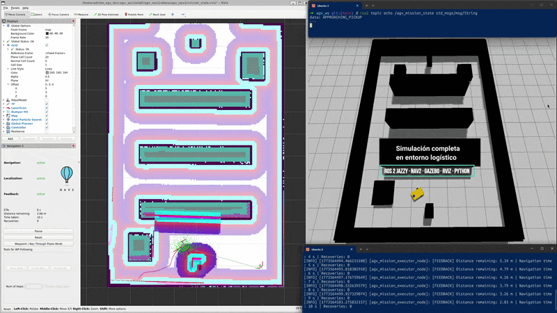
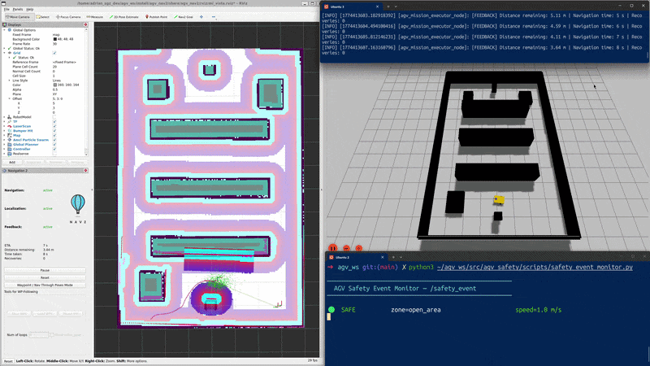

# 🤖 Autonomous AGV Logistics Platform | ROS 2 Jazzy + Nav2

**Industrial AGV simulation platform built in phases to demonstrate autonomous navigation, mission execution, and zone-based safety supervision using ROS 2, Nav2, Gazebo, and Python.**

This repository documents the evolution of a simulated Automated Guided Vehicle (AGV) project developed as a portfolio-focused transition into **AGV/AMR robotics, automation, and applied software**.

> Developed by Adrián Zaragoza Martínez — Electromechanical Technician transitioning into Robotics, Automation, and Software applied to industrial environments.

---

## 📽️ Project demonstrations

### Phase 2 — Mission execution and industrial maneuver refinement

Demonstrates a complete AGV mission workflow with:
- approach behavior
- pickup logic
- loading / unloading simulation
- dropoff execution
- mission state transitions
- retry / watchdog robustness improvements



### Phase 3 — Zone-based safety supervision

Adds a dedicated safety monitoring layer that evaluates AGV position in real time against configurable geofenced zones and publishes structured safety events during mission execution.

This phase demonstrates:
- real-time safety zone detection
- `SAFE`, `SLOW`, `STOP`, and `RESTRICTED` events
- RViz zone visualization
- decoupled supervision architecture
- custom terminal feedback for demo recording and technical presentation



> Replace the GIF filename above with your final exported demo if needed.

---

## 🧠 What this repository demonstrates

| Capability | Detail |
|---|---|
| Autonomous navigation | Nav2-based AGV navigation in a simulated warehouse map |
| Mission execution | Pickup, loading, dropoff, and unloading workflow with state-driven execution |
| Behavior tuning | Manual refinement of approach poses and pickup behavior for more realistic maneuvering |
| Fault handling | Retry logic, watchdog timeout ideas, and mission result reporting |
| Safety supervision | Zone-based monitoring independent from the navigation and mission logic |
| Event-driven ROS 2 architecture | Decoupled nodes communicating through topics |
| Visual validation | Gazebo + RViz + terminal monitoring for portfolio-friendly demonstrations |

---

## 🗺️ Project evolution

### Phase 1 — Autonomous AGV navigation fundamentals
Initial warehouse navigation demo built with:
- ROS 2 Jazzy
- Nav2
- Gazebo
- RViz
- Python

Core focus:
- path planning
- localization
- obstacle avoidance
- simulated AGV navigation

### Phase 2 — Mission execution workflow
The project evolved from basic navigation into a more realistic logistics mission demo.

Key additions:
- approach → pickup → loading → dropoff → unloading mission flow
- mission executor node in Python
- manual pose refinement for more natural pickup behavior
- validation through iterative simulation in RViz + Gazebo

### Phase 3 — Zone-based safety supervision
This phase extends the AGV mission demo with a dedicated supervision layer.

Key additions:
- `safety_monitor_node`
- configurable polygon zones in YAML
- real-time evaluation from `/amcl_pose`
- safety event publishing through `/safety_event`
- RViz markers for operational area visualization
- presentation-oriented terminal safety event monitor

This repository reflects the **evolution of the same AGV platform**, not isolated one-off demos.

---

## 🏗️ Current architecture

```text
/amcl_pose  ──────────────────────────────────┐
                                               ▼
zones.yaml ──────────► safety_monitor_node ──► /safety_event
                              │
                              └──► /safety_zones_markers ──► RViz

mission_executor_node ───────► NavigateToPose / mission state flow
```

### Main components

- **`agv_nav2`** → Navigation stack integration and maps
- **`agv_mission_executor`** → Mission sequencing logic
- **`agv_safety`** → Zone-based safety supervision layer
- **Gazebo + RViz** → Simulation and validation environment

---

## 📦 Repository structure

```text
agv_logistics_nav2/
├── src/
│   ├── agv_bringup/
│   ├── agv_description/
│   ├── agv_mission_executor/
│   ├── agv_nav2/
│   ├── agv_safety/
│   │   ├── agv_safety/
│   │   │   ├── safety_monitor_node.py
│   │   │   └── zone_checker.py
│   │   ├── config/
│   │   │   └── zones.yaml
│   │   ├── launch/
│   │   │   ├── safety_demo_launch.py
│   │   │   └── sim_launch.py
│   │   ├── scripts/
│   │   │   └── safety_event_monitor.py
│   │   └── test_zones.py
│   └── ...
├── README.md
├── demo.gif
└── demo_phase_2.gif
```

---

## 🛡️ Safety supervision layer

The `agv_safety` package introduces a **zone-based safety supervision layer** for simulated AGV operations.

### Safety zone types

| Type | Color in RViz | Operational meaning |
|---|---|---|
| `SAFE` | Green | Normal navigation area |
| `SLOW` | Amber | Reduced-speed area such as shared or pedestrian-adjacent space |
| `STOP` | Red | Full-stop operational area such as pickup / loading zone |
| `RESTRICTED` | Purple | Area where AGV operation is not allowed |

### Safety event example

```text
STOP|pallet_pickup_zone|0.0
SLOW|picking_corridor_entry|0.3
SAFE|open_area|1.0
```

### Why this matters
This phase moves the project closer to a more realistic AGV/AMR workflow by adding:
- operational area awareness
- configurable safety zoning
- structured event supervision
- clearer system observability during mission execution

This project focuses on **safety supervision and observability**, not certified safety control.

---

## 🖥️ Demo operator feedback

To improve readability during demo recording and technical presentations, the project also includes a custom terminal-based safety event monitor.

Compared with raw `ros2 topic echo`, this script provides:
- cleaner event output
- color-coded transitions
- better readability in portfolio videos
- clearer interpretation of zone changes during mission execution

This is especially useful when recording demonstrations for GitHub, LinkedIn, and portfolio pages.

---

## 🚀 Quickstart

### Prerequisites

- Ubuntu / Linux
- ROS 2 Jazzy
- Nav2
- Gazebo (`gz-sim`)
- RViz
- Workspace: `~/agv_ws`

### Build workspace

```bash
cd ~/agv_ws
colcon build --symlink-install
source install/setup.zsh
```

### Launch AGV navigation + safety supervision

```bash
ros2 launch agv_safety safety_demo_launch.py
```

### Run the mission executor

```bash
ros2 run agv_mission_executor mission_node
```

### Monitor safety events

Basic topic output:

```bash
ros2 topic echo /safety_event
```

Optional presentation-oriented monitor:

```bash
ros2 run agv_safety safety_event_monitor.py
```

### Zone logic validation without simulation

```bash
cd ~/agv_ws/src/agv_safety
python3 test_zones.py
```

---

## 🔬 Design decisions

### Why evolve the same repository?
This project is intentionally developed as a phased evolution of the same AGV platform.

That reflects a more realistic engineering workflow:
- start with a working navigation base
- extend it with mission logic
- then add supervision and operational constraints

This is more credible for portfolio purposes than creating disconnected demo repositories.

### Why a separate safety node?
The safety monitor is decoupled from the mission executor on purpose.

In industrial systems, supervision logic is typically treated as an independent layer that should continue evaluating the operational area regardless of what the application or task layer is doing.

### Why pure Python for zone checking?
The geometry logic is separated from ROS 2 so it can be tested faster and more cleanly.

This improves maintainability and allows quick validation of polygon behavior without launching the full simulation stack.

### Why YAML for zone definitions?
Safety zones often change during deployment due to:
- map adjustments
- process updates
- temporary operational restrictions
- layout evolution

Using YAML allows fast zone updates without modifying node logic.

---

## 📊 Example validated mission result

```text
Tasks succeeded:         3/3
Total mission time:      70.80s
Total recovery events:   0

Zone transitions detected:
  SLOW  → dispatch_dropoff_zone     (0.25 m/s)
  SAFE  → open_area                 (1.0 m/s)
  SLOW  → picking_corridor_entry    (0.3 m/s)
  STOP  → pallet_pickup_zone        (0.0 m/s)  ← safety event detected
  SLOW  → picking_corridor_entry    (0.3 m/s)
  SAFE  → open_area                 (1.0 m/s)
  SLOW  → dispatch_dropoff_zone     (0.25 m/s)
```

This shows that the AGV mission can complete successfully while the safety supervision layer continuously detects and publishes zone transitions in real time.

---

## 🎯 Portfolio positioning

This repository is designed to demonstrate a practical progression toward **AGV/AMR robotics roles** by combining:
- industrial field experience
- machine behavior understanding
- ROS 2 and Nav2 integration
- Python-based mission logic
- simulation-based validation
- safety-oriented operational thinking

The focus is not academic robotics for its own sake, but **credible industrial proof-of-concept development**.

---

## 👤 About

**Adrián Zaragoza Martínez**  
Electromechanical Technician | AGV/AMR Field Service | Transitioning into Robotics, Automation, and Applied Software

25+ years of industrial experience in diagnostics, machine behavior, field service, and real operational environments. Now building a hybrid profile that combines industrial knowledge with robotics software development.

🌐 [adrianzgzdev.com](https://adrianzgzdev.com)  
💼 [LinkedIn](https://www.linkedin.com/in/adrianzgzdev)  
🐙 [GitHub](https://github.com/adrianzgzdev)

---

## 🏷️ Suggested repository description

**Autonomous AGV logistics platform using ROS 2 Jazzy, Nav2, Gazebo, mission execution, and zone-based safety supervision.**

## 🏷️ Suggested topics

`ros2` `jazzy` `nav2` `gazebo` `python` `robotics` `agv` `amr` `autonomous-vehicles` `warehouse-automation`
