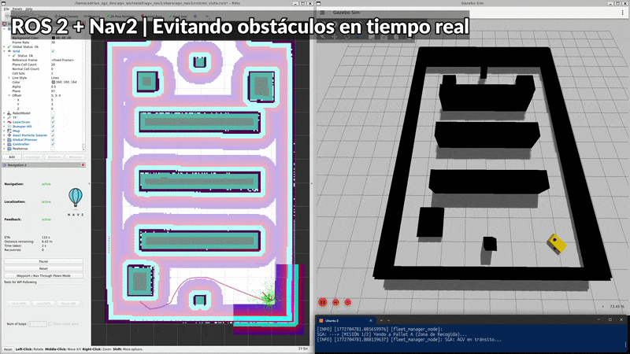

# 🤖 Autonomous AGV Logistics & Fleet Management (ROS 2 Jazzy)


This repository contains a full-stack robotics project developing an autonomous Automated Guided Vehicle (AGV) for warehouse logistics. Built from the ground up using **ROS 2 Jazzy**, **Nav2**, and **Gazebo**, it includes physical simulation, topographic SLAM mapping, and a custom Warehouse Management System (WMS) written in Python.

---

## 🎥 Project Demonstration



---

## 🚀 Key Features & Milestones

* **🔧 Physical Hardware Simulation:** Custom URDF and SDF modeling with fine-tuned kinematics, wheel friction (slip compliance), and LiDAR sensor integration in modern Gazebo.
* **🗺️ Topographic SLAM Mapping:** Precision mapping of the industrial warehouse environment using SLAM algorithms to generate robust 2D occupancy grids.
* **🧠 Dynamic Autonomous Navigation:** Full Nav2 stack integration. Features include global path planning, local trajectory calculation (Behavior Trees), and real-time dynamic obstacle avoidance using Local Costmaps.
* **📦 Custom Fleet Manager (WMS):** A high-level Python application acting as the central control system. It uses ROS 2 Asynchronous `Action Clients` to orchestrate complex multi-waypoint logistic routes, simulating payload pickup/drop-off sequences and shift management.

## 💻 Tech Stack

* **Framework:** ROS 2 (Jazzy Jalisco)
* **Languages:** Python (WMS API), C++ (Underlying ROS nodes), XML/YAML (Configuration)
* **Simulation & Visualization:** Gazebo (Ignition), RViz2
* **Navigation & Mapping:** Nav2, SLAM Toolbox, AMCL (Adaptive Monte Carlo Localization)

## 🛠️ How to Run

1. **Launch the Simulation & Navigation Stack:**
   ```bash
   ros2 launch agv_nav2 navigation.launch.py
   ```
   *This initializes Gazebo, loads the warehouse map, spawns the AGV, and brings up RViz with the Nav2 panel.*

2. **Execute the Logistic Shift (Fleet Manager):**
   ```bash
   ros2 run agv_nav2 fleet_manager.py
   ```
   *The AGV will automatically receive its waypoints, navigate to the pickup zone, simulate a 5-second loading maneuver, and transport the cargo to the Expedition Zone, dynamically evading any obstacles in its path.*

---
👨‍💻 **Developed by Adrián** | 🔗 Let's connect on [LinkedIn](https://www.linkedin.com/in/adrianzgzdev/)


