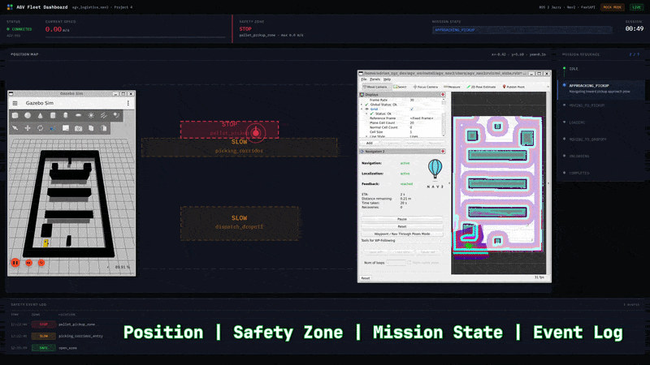

# 🤖 Autonomous AGV Logistics Platform | ROS 2 + Nav2 + FastAPI + WebSocket + React

**Industrial AGV simulation platform built in phases to demonstrate autonomous navigation, mission execution, zone-based safety supervision, and real-time web-based monitoring using ROS 2, Nav2, Gazebo, Python, FastAPI, WebSocket, and React.**

This repository documents the evolution of a simulated Automated Guided Vehicle (AGV) project developed as a portfolio-focused transition into **AGV/AMR robotics, automation, and applied software**.

> Developed by Adrián Zaragoza Martínez — Electromechanical Technician transitioning into Robotics, Automation, and Software applied to industrial environments.

---

## 📽️ Project demonstrations

### Phase 2 — Mission execution and industrial maneuver refinement

Demonstrates a complete AGV mission workflow with:
- approach behavior
- pickup logic
- loading / unloading simulation
- dropoff execution
- mission state transitions
- retry / watchdog robustness improvements


### Phase 3 — Zone-based safety supervision

Adds a dedicated safety monitoring layer that evaluates AGV position in real time against configurable geofenced zones and publishes structured safety events during mission execution.

This phase demonstrates:
- real-time safety zone detection
- `SAFE`, `SLOW`, `STOP`, and `RESTRICTED` events
- RViz zone visualization
- decoupled supervision architecture
- custom terminal feedback for demo recording and technical presentation


### Phase 4 — Real-time AGV fleet dashboard

Adds a web-based industrial monitoring layer connected to ROS 2 through a FastAPI backend and WebSocket streaming.

This phase demonstrates:
- real-time AGV position tracking
- current speed monitoring
- safety zone status visualization
- mission state synchronization
- mission sequence / step tracking
- timestamped safety event log
- backend-to-frontend live data flow
- mock mode and live ROS 2 mode for UI development and demo validation



---

## 🧠 What this repository demonstrates

| Capability | Detail |
|---|---|
| Autonomous navigation | Nav2-based AGV navigation in a simulated warehouse map |
| Mission execution | Pickup, loading, dropoff, and unloading workflow with state-driven execution |
| Behavior tuning | Manual refinement of approach poses and pickup behavior for more realistic maneuvering |
| Safety supervision | Zone-based monitoring independent from navigation and mission logic |
| Event-driven ROS 2 architecture | Decoupled nodes communicating through topics |
| Backend integration | FastAPI layer exposing AGV telemetry and system state |
| Real-time streaming | WebSocket pipeline for live frontend updates |
| Frontend monitoring | React dashboard for AGV visibility and observability |
| Visual validation | Gazebo + RViz + dashboard monitoring for portfolio-friendly demonstrations |

---

## 🗺️ Project evolution

### Phase 1 — Autonomous AGV navigation fundamentals

Initial warehouse navigation demo built with:
- ROS 2 Jazzy
- Nav2
- Gazebo
- RViz
- Python

Core focus:
- path planning
- localization
- obstacle avoidance
- simulated AGV navigation

### Phase 2 — Mission execution workflow

The project evolved from basic navigation into a more realistic logistics mission demo.

Key additions:
- approach → pickup → loading → dropoff → unloading mission flow
- mission executor node in Python
- manual pose refinement for more natural pickup behavior
- validation through iterative simulation in RViz + Gazebo

### Phase 3 — Zone-based safety supervision

This phase extends the AGV mission demo with a dedicated supervision layer.

Key additions:
- `safety_monitor_node`
- configurable polygon zones in YAML
- real-time evaluation from `/amcl_pose`
- safety event publishing through `/safety_event`
- RViz markers for operational area visualization
- presentation-oriented terminal safety event monitor

### Phase 4 — Real-time fleet dashboard

This phase extends the AGV platform with a web-based monitoring interface designed to visualize live system state in a more operator-friendly format.

Key additions:
- FastAPI backend connected to ROS 2 data sources
- WebSocket-based real-time streaming
- React dashboard with industrial dark UI
- live AGV position visualization on a 2D map
- current speed display
- safety zone status panel
- mission state and mission sequence tracking
- safety event log with timestamps
- mock mode for frontend development without ROS 2
- live mode for full ROS 2 integration demos

This phase shifts the project from simulation-only validation toward **full-stack industrial observability**.

This repository reflects the **evolution of the same AGV platform**, not isolated one-off demos.

---

## 🏗️ Current architecture

```text
/amcl_pose ───────────────┐
/safety_event ────────────┼──────────────┐
mission state / sequence ─┘              │
                                         ▼
                              FastAPI backend
                                         │
                                         ▼
                                   WebSocket
                                         │
                                         ▼
                                 React dashboard

ROS 2 + Gazebo + RViz  ─────────────────────► simulation and validation layer
Main components
agv_nav2 → Navigation stack integration and maps
agv_mission_executor → Mission sequencing logic
agv_safety → Zone-based safety supervision layer
FastAPI backend → Bridge between ROS 2 state and web clients
React frontend → Real-time AGV fleet dashboard
Gazebo + RViz → Simulation and validation environment
📦 Repository structure
agv_logistics_nav2/
├── src/
│   ├── agv_bringup/
│   ├── agv_description/
│   ├── agv_mission_executor/
│   ├── agv_nav2/
│   ├── agv_safety/
│   │   ├── agv_safety/
│   │   │   ├── safety_monitor_node.py
│   │   │   └── zone_checker.py
│   │   ├── config/
│   │   │   └── zones.yaml
│   │   ├── launch/
│   │   │   └── safety_demo_launch.py
│   │   └── ...
│
├── agv_dashboard/
│   ├── backend/
│   │   ├── main.py
│   │   └── ...
│   ├── frontend/
│   │   ├── src/
│   │   └── ...
│   └── demo_mission.py
│
├── README.md
├── demo_phase_2.gif
├── demo_phase_3.gif
└── demo_phase_4.gif
🛡️ Safety supervision layer

The agv_safety package introduces a zone-based safety supervision layer for simulated AGV operations.

Safety zone types
Type	Color in RViz	Operational meaning
SAFE	Green	Normal navigation area
SLOW	Amber	Reduced-speed area such as shared or pedestrian-adjacent space
STOP	Red	Full-stop operational area such as pickup / loading zone
RESTRICTED	Purple	Area where AGV operation is not allowed
Safety event example
STOP|pallet_pickup_zone|0.0
SLOW|picking_corridor_entry|0.3
SAFE|open_area|1.0
Why this matters

This phase moves the project closer to a more realistic AGV/AMR workflow by adding:

operational area awareness
configurable safety zoning
structured event supervision
clearer system observability during mission execution

This project focuses on safety supervision and observability, not certified safety control.

🖥️ Phase 4 dashboard overview

The AGV Fleet Dashboard introduces a real-time industrial monitoring layer on top of the ROS 2 simulation stack.

Dashboard data shown
AGV position on a 2D map
current speed
active safety zone
mission state
mission sequence / current step
safety event log with timestamps
Operating modes
Mock mode → frontend demo without ROS 2
Live mode → real ROS 2 data streamed through FastAPI and WebSocket
Why this matters

This phase demonstrates that the project is no longer limited to robotics simulation logic only.

It now includes:

backend integration
frontend state visualization
real-time data streaming
operator-oriented observability
full-stack thinking applied to industrial robotics
🚀 Quickstart
Prerequisites
Ubuntu / Linux
ROS 2 Jazzy
Nav2
Gazebo (gz-sim)
RViz
Python 3
Node.js / npm
Workspace: ~/agv_ws
Build workspace
cd ~/agv_ws
colcon build --symlink-install
source ~/agv_ws/install/setup.zsh
Run the full Phase 4 demo

The startup order matters:

simulation
backend
frontend
mission trigger
Terminal 1 — ROS 2 simulation
source ~/agv_ws/install/setup.zsh
ros2 launch agv_safety safety_demo_launch.py
Terminal 2 — FastAPI backend
source ~/agv_ws/install/setup.zsh
cd ~/agv_ws/agv_dashboard/backend
python3 -m uvicorn main:app --host 0.0.0.0 --port 8000 --reload
Terminal 3 — React frontend
cd ~/agv_ws/agv_dashboard/frontend
npm run dev

Then open the browser at:

http://localhost:3000 → dashboard in MOCK MODE
http://localhost:3000/?mock=false → dashboard with live ROS 2 data
Terminal 4 — Demo mission
source ~/agv_ws/install/setup.zsh
python3 ~/agv_ws/agv_dashboard/demo_mission.py
🔄 Data flow

The Phase 4 demo follows this architecture:

ROS 2 → FastAPI → WebSocket → React

This allows the dashboard to reflect live AGV state from the simulation stack in a web-based UI designed for industrial monitoring and demo presentation.

🔬 Design decisions
Why evolve the same repository?

This project is intentionally developed as a phased evolution of the same AGV platform.

That reflects a more realistic engineering workflow:

start with a working navigation base
extend it with mission logic
then add supervision and operational constraints
finally add a monitoring layer for system observability

This is more credible for portfolio purposes than creating disconnected demo repositories.

Why a separate safety node?

The safety monitor is decoupled from the mission executor on purpose.

In industrial systems, supervision logic is typically treated as an independent layer that should continue evaluating the operational area regardless of what the application or task layer is doing.

Why FastAPI + WebSocket?

The dashboard requires a lightweight backend capable of exposing live system state to web clients.

This design enables:

real-time updates
clean separation between ROS 2 and frontend code
easier debugging and UI iteration
a more realistic industrial software architecture
Why a React dashboard?

A web-based UI makes the simulation easier to observe, present, and extend.

It also demonstrates frontend capability in a context directly connected to AGV and automation workflows.

Why YAML for zone definitions?

Safety zones often change during deployment due to:

map adjustments
process updates
temporary operational restrictions
layout evolution

Using YAML allows fast zone updates without modifying node logic.

📊 Example validated mission result
Tasks succeeded:         3/3
Total mission time:      70.80s
Total recovery events:   0

Zone transitions detected:
  SLOW  → dispatch_dropoff_zone     (0.25 m/s)
  SAFE  → open_area                 (1.0 m/s)
  SLOW  → picking_corridor_entry    (0.3 m/s)
  STOP  → pallet_pickup_zone        (0.0 m/s)  ← safety event detected
  SLOW  → picking_corridor_entry    (0.3 m/s)
  SAFE  → open_area                 (1.0 m/s)
  SLOW  → dispatch_dropoff_zone     (0.25 m/s)

This shows that the AGV mission can complete successfully while the safety supervision layer continuously detects and publishes zone transitions in real time.

🎯 Portfolio positioning

This repository is designed to demonstrate a practical progression toward AGV/AMR robotics, automation, and junior full-stack roles applied to industrial systems by combining:

industrial field experience
machine behavior understanding
ROS 2 and Nav2 integration
Python-based mission logic
safety-oriented operational thinking
FastAPI backend development
WebSocket-based real-time communication
React frontend monitoring
simulation-based validation

The focus is not academic robotics for its own sake, but credible industrial proof-of-concept development with real backend and frontend integration.

👤 About

Adrián Zaragoza Martínez
Electromechanical Technician | AGV/AMR Field Service | Transitioning into Robotics, Automation, and Applied Software

25+ years of industrial experience in diagnostics, machine behavior, field service, and real operational environments. Now building a hybrid profile that combines industrial knowledge with robotics software development.

🌐 adrianzgzdev.com

💼 LinkedIn

🐙 GitHub